KOEHREN Teddy 1SN BTS 18/01/2023

**E6.2 Téléscope : Fiche Technique IHM WEB**

**Table des matières**

[E6.2 Téléscope : Fiche Technique IHM WEB.....................................................................................1 ](#_page0_x109.05_y110.10)[Contexte :....................................................................................................................................1](#_page0_x56.70_y520.75)

1. [Création d’une page WEB statique au préalable..............................................................................2](#_page1_x56.70_y96.65)
1. [Création et communication avec la BDD telescope.........................................................................4](#_page3_x56.70_y84.65)
1. [Migration du site web sur la raspberry.............................................................................................5](#_page4_x56.70_y84.65)
1. [Réception et formatage de la trame GSV en PHP............................................................................6](#_page5_x56.70_y84.65)
1. [Création du programme de calcul en JavaScript..............................................................................8](#_page7_x56.70_y96.65)
1. [Création d’une fiche de données sur l’IHM sur le calcul...............................................................11](#_page10_x56.70_y96.65)
1. [Correction des bugs et optimisation de l’utilisation.......................................................................12](#_page11_x56.70_y96.65)
1. [Impossible de réceptionner les données GPS....................................................................12](#_page11_x56.70_y146.45)
1. [Tri alphabétique des objets de Messier affichés................................................................12](#_page11_x56.70_y396.90)
1. [Les tailles des div ne fonctionnent plus dans un form.......................................................12](#_page11_x56.70_y620.65)
3. [Migration des travaux sur un ordinateur lambda...............................................................13](#_page12_x56.70_y288.30)
3. [Gérer l’absence de GPS.....................................................................................................14](#_page13_x56.70_y148.85)

[7.4. Rendre le site web responsive et + ergonomique...............................................................14](#_page13_x56.70_y323.45)

8. [Communication avec ESP et format de transmission.....................................................................15](#_page14_x56.70_y84.65)
9. [Communication avec l’ESP : sockets.............................................................................................16](#_page15_x56.70_y84.65)
9. [Ajout de catalogues dans la base de données...............................................................................17](#_page16_x56.70_y96.65)
1. [Préparation et ajout des catalogues dans la base de donnée.............................................17](#_page16_x56.70_y130.60)
1. [Création d’un filtre de constellation selon le catalogue...................................................18](#_page17_x56.70_y569.00)
1. [Création d’un filtre de saison et d’hémisphère................................................................19](#_page18_x56.70_y449.55)
1. [Création d’une barre de recherche...................................................................................20](#_page19_x56.70_y444.75)
11. [Ajout d’un catalogue personnalisé et la possibilité de sauvegarder des astres (Ajax).................21](#_page20_x56.70_y84.65)

**Contexte :** 

L’IHM WEB permettra à l’utilisateur d’interagir avec l’entièreté du système, le gps, la base de données, le calcul de coordonnées et la communication avec l’ESP devra se réaliser sur celui ci. Une maquette est fourni selon les demandes du CDC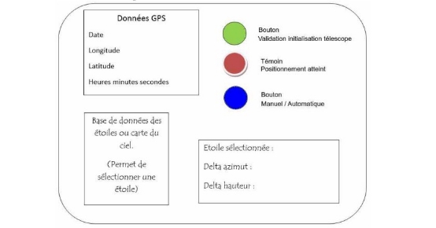 :

Fiche\_Technique\_IHM\_Web.odt KOEHREN Teddy

1. **Création d’une page WEB statique au préalable**

Code source disponible dans /source

1) Création du modèle avec des blocs div :

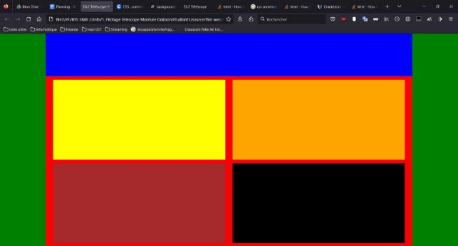

2) Mise en forme du modèle créé :

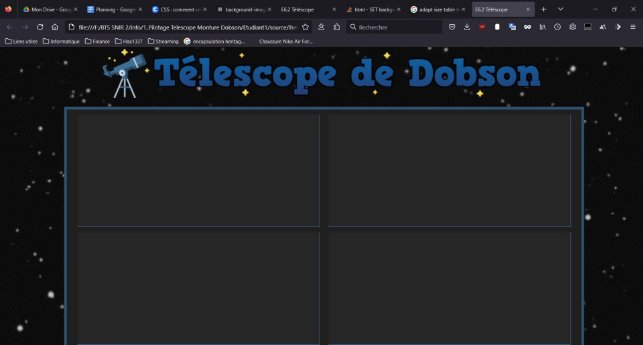

3) Ajout des éléments web sur la page :

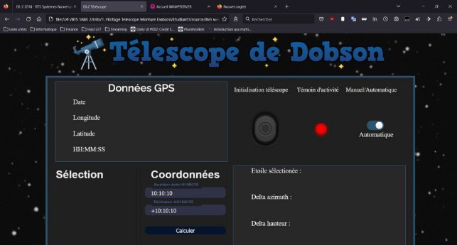

\5) Création du modèle de la base de données

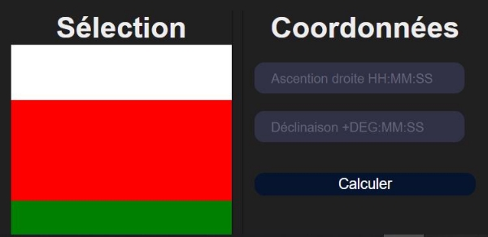

2. **Création et communication avec la BDD telescope**

Code source disponible dans /source

1) Installation Wamp pour créer le début de la base de données télescope :

Récupération du catalogue de messier et ajout des coordonnées sur certains objets astrales et ajout de la table dans la DB « telescope ».

2) Import des lignes de la colonne de Messier sur l’IHM web en PHP

3) Import des coordonnées de l’astre sélectionné

La page est en PHP et vérifie qu’une valeur du formulaire de sélection existe à chaque chargement de page, si c’est le cas, une requête SQL est envoyé pour récupérer l’ascension droite et la déclinaison.

Si une valeur est trouvé, elle est placée dans les champs d’entrées.

3. **Migration du site web sur la raspberry**
- Installation de la pile Lamp :

sudo apt-get install apache2 php libapache2-mod-php mariadb-server php-mysql

- Installations des modules PHP les plus courants :

sudo apt-get install php-curl php-gd php-intl php-json php-mbstring php-xml php-zip

- Deplacement du site et des images dans le répertoire PHP /var/www/html/ et de la base de données telescope de wamp dans /var/lib/mysql/
- Installation de phpmyadmin avec la configuration automatique sur apache2 : sudo apt-get install phpmyadmin

Mot de passe : password pour l’utilisateur phpmyadmin

- Mis à jour et redémarrage :

sudo apt-get update && sudo apt-get upgrade && sudo reboot

- Creation utilisateur root mysql sudo mysql -u root password
- Ajout du mot de passse password sur la page php pour se connecter à la DB sudo nano /var/www/html/version\_finale/home.php
- Accès sur le pannel de phpmyadmin possible via root:password → [*http://192.168.4.1/phpmyadmin*](http://192.168.4.1/phpmyadmin) en wlan

[*http://172.20.81.221*](http://192.168.4.1/version_finale/home.php)[/phpmyadmin*](http://192.168.4.1/phpmyadmin) en eth0

- Redémarrage de Mysql : sudo systemctl restart mysql
- Accès au site via : [*http://192.168.4.1/version_finale/home.php*](http://192.168.4.1/version_finale/home.php) en wlan [*http://172.20.81.221/version_finale/home.php*](http://192.168.4.1/version_finale/home.php) en eth0
4. **Réception et formatage de la trame GSV en PHP**

Un script python a été réalisé et permet de récupérer la trame GSV contenant toutes les informations nécessaires à l’IHM Web.

/\* RECUPERATION DONNEES GPS AVEC SCRIPT PYTHON \*/

exec("python3 /home/pi/gps/gps.py",$gps\_result); // envoie un array des print réalisés $gps\_trame = $gps\_result[0]; 

echo "résultat: $gps\_trame[0]";

Si une erreur est reçu, le site affichera le résultat GPS comme étant une erreur, dans le cas contraire, on découpe la trame à chaque séparateur avec explode() et on récupère les données qui nous sont nécessaires.

if ($gps\_trame == "ERREUR GPS") // si un problème survient avec le gps

{

$gps\_var\_date = $gps\_var\_longitude = $gps\_var\_latitude = $gps\_var\_time = "ERREUR GPS";

}

else

{

$gps\_trame\_array = explode(',',$gps\_trame); 

$gps\_var\_date = $gps\_trame\_array[9]; $gps\_var\_date = substr\_replace($gps\_var\_date,'/',4,0); $gps\_var\_date = substr\_replace($gps\_var\_date,'/',2,0); // ajout slash sur la date

$gps\_var\_longitude = $gps\_trame\_array[5].','.$gps\_trame\_array[6];

$gps\_var\_latitude = $gps\_trame\_array[3].','.$gps\_trame\_array[4];

$gps\_var\_time = substr($gps\_trame\_array[1],0,6); $gps\_var\_time = substr\_replace($gps\_var\_time,':',4,0); $gps\_var\_time = substr\_replace($gps\_var\_time,':',2,0);

}

Un formattage est également effectué : on rajoute des slashs sur la date, deux points sur l’heure avec la fonction substr\_replace(), et concatène pour les coordonnées géographiques.

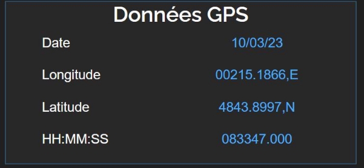

On formate l’heure et les coordonnées :

$gps\_trame\_array = explode(',',$gps\_trame); 

$gps\_var\_date = $gps\_trame\_array[9];

$gps\_var\_date = substr\_replace($gps\_var\_date,'/',4,0); // ajout slash sur la date $gps\_var\_date = substr\_replace($gps\_var\_date,'/',2,0); // ajout slash sur la date

$gps\_var\_longitude = strval(intval(substr($gps\_trame\_array[5],0,3))).'°'; // on recupere les 3 premiers nb pour les degrés, on enlève les 0 en trop en passant la string en int

$gps\_var\_longitude = $gps\_var\_longitude . substr($gps\_trame\_array[5],3,2).'\''; // récupération des minutes

$gps\_var\_longitude = $gps\_var\_longitude .                                                      strval(intval(intval(substr($gps\_trame\_array[5],6,2))/100\*60)).'",'; // conversion des degrés décimales en minutes

$gps\_var\_longitude = $gps\_var\_longitude . $gps\_trame\_array[6];

if (intval(substr($gps\_trame\_array[5],0,3)) > 0) // si le nombre est positif on rajoute un + pour le format physique

{$gps\_var\_longitude = '+'.$gps\_var\_longitude;}

$gps\_var\_latitude = strval(intval(substr($gps\_trame\_array[3],0,2))).'°';

$gps\_var\_latitude = $gps\_var\_latitude . substr($gps\_trame\_array[3],2,2).'\'';

$gps\_var\_latitude = $gps\_var\_latitude . strval(intval(intval(substr($gps\_trame\_array[3],5,2))/100\*60)).'",';

$gps\_var\_latitude = $gps\_var\_latitude . $gps\_trame\_array[4];

$gps\_var\_time = substr($gps\_trame\_array[1],0,6);

$gps\_var\_time = substr\_replace($gps\_var\_time,':',4,0); // on met : de séparation

$gps\_var\_time = substr\_replace($gps\_var\_time,':',2,0); // on met : de séparation

$gps\_var\_hour = intval(substr($gps\_var\_time,0,2))+1; // recuperation heure en integer

if ($gps\_var\_hour > 23) // on rajoute une heure pour UTC+1

{$gps\_var\_hour = 0;} 

if ($gps\_var\_hour < 10) // on rajoute un zero si un seul chiffre, on remet en string

$gps\_var\_hour = '0'.strval($gps\_var\_hour);

$gps\_var\_time = $gps\_var\_hour . substr($gps\_var\_time,2,7); // on rajoute l'heure en concatenant

Résultat final :

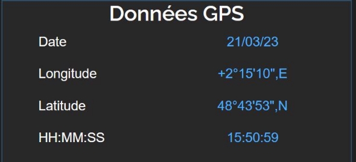

5. **Création du programme de calcul en JavaScript**

On choisira d’effectuer le calcul du coté client à l’aide d’un script JavaScript pour permettre d’économiser la puissance du serveur.

Déclaration des variables des données nécessaires ainsi que leur description en commentaire :

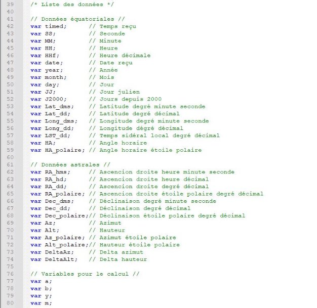

Création d’un bouton pour appeler une fonction qui se chargera de faire le calcul et d’afficher le résultat.

Un traitement des données récupérés sur le site avec Javascript est nécessaire pour isoler les valeurs :

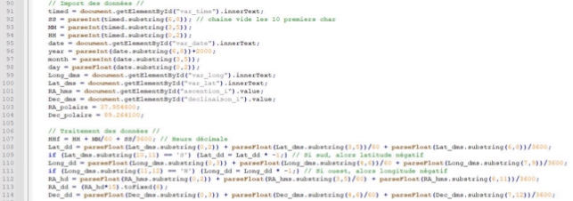

Les types doivent être conservés en tant qu’entier ou nombre flottant afin de ne pas poursuivre un calcul avec une string.

Des découpages sur chaque valeurs string sont nécessaires et une conversion avec ParseFloat() ou ParseInt() permet l’isolation flottante de la valeur.

Note : l’utilisation de fonctions d’arrondis pour réduire le nombre de décimales peuvent retourner la valeur flottante en string ce qui provoquera un problème pour la suite. On choisira d’utiliser ToFixed() pour obtenir un nombre flottant en sortie.

Des conversions sont nécessaires sur les coordonnées en degré/heure minute secondes grace à des calculs simples ((h+m/60+s/3600)/15 etc.) 

Après résolution de nombreux problèmes de types, on affichera la variable grace à un élément marqué par un ID sur la page web qui permettra son unicité on utilisera

Pour les formulaires :

document.getElementById("myIDDD").innerHTML;

Pour le reste :

document.getElementById("myIDDD").innerHTML;

Pour récupérer aussi la balise html :

document.getElementById("myIDDD").outerHTML;

Une fonction est créé pour ramener les valeurs dans la plage de 0 à 360°

Note : L’utilisation d’un modulo 360 sera plus optimisé pour la suite

création fonction plage 360 fonction degrée radians pour Math paramètres radians

nouveau algo jj

feuille calcul

Afin de calculer Azimut et hauteur, on utilisera la bibliothèque Math permettant d’utiliser les fonctions trigonométriques en radians seulement, on aura alors :

Pour le calcul de delta azimut et delta hauteur :

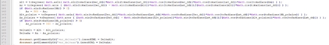

On affiche bien le résultat du calcul :

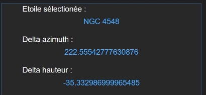

Afin de faciliter le mouvement du télescope on ramène dans une plage de 180° pour accélerer le processus (pour 222 on aura donc -138, cela signifie qu’on ira plus rapidement dans le sens anti- horaire)

Note : L’utilisation d’une étoile pendant la saison actuelle est conseillé puisqu’elle permettra d’être dans une delta hauteur observable (entre 0 et 90°)

6. **Création d’une fiche de données sur l’IHM sur le calcul**

Après de nombreux problèmes rencontrés, pour les résoudre et afin de faciliter l’affichage des données pour l’utilisateur ou le développeur on rajoute une div caché en arrière plan affichable grâce un bouton. Celle ci affichera un tableau de l’ensemble des valeurs utilisées pour le calcul :

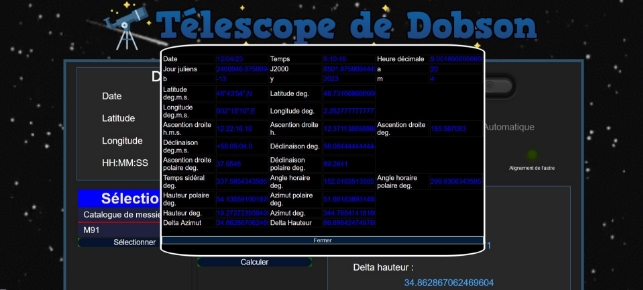

Chaque valeur affiché est composé d’un ID permettant l’ajout sur la page web depuis Javascript :

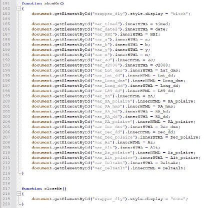

7. **Correction des bugs et optimisation de l’utilisation.**
1. **Impossible de réceptionner les données GPS**

Lorsque le GPS ne fonctionne pas faute de non réception (ciel inaccessible, endroit clos empêchant la réception satellitaire), on reçoit alors des coordonnées vide :

0°'0", 

°'0", 

On gérera cet exception dans JavaScript (on bloque la réception GPS)

2. **Tri alphabétique des objets de Messier affichés**

En effet, il s’agira de faire une requête plus élaboré pour afficher les objets de Messier dans l’ordre numéroté. Cependant il y a une lettre char afin des nombres qui ne permet pas ce tri facilement.

On isolera ces nombres et on les triera de la sorte :

SELECT Messier FROM catalogue\_messier ORDER BY CAST(SUBSTR(Messier, 2) AS INTEGER) ASC;

On arrive à un tri numérique :

3. **Les tailles des div ne fonctionnent plus dans un form**

Les div sont définies par des tailles proportionnel à la taille de la page, hélas lorsqu’elles sont encadrés par une balise <form> on remarque que ces tailles ne sont plus respectés.

Après d’amples recherches et l’isolation du problèmes sur une page il s’agit d’un problème d’affichage qui peut être testé en css avec display pour changer l’ordre et la façon de présenter l’objet sur la page. On utilisera alors display: grid;

3. **Migration des travaux sur un ordinateur lambda**

Afin de pouvoir ouvrir les travaux réalisés dans cette fiche sans nécessiter du matériel du télescope, on prévoit de pouvoir l’ouvrir sur un ordinateur lambda. On prendra pour exemple la dernière version de Wamp qui utilise cependant des versions anciennes de PHP et de Mysql.

- Pour commencer on doit s’assurer que l’utilisateur root a bien le même password que le système, ou  bien changer le mot de passer dans le code PHP.
- Puisque nous n’aurons probablement pas de GPS, il faudra gérer l’erreur du fichier 

introuvable de gestion du GPS :

- Pour faciliter la détection d’erreur on gérera davantage les exceptions dans la fonction gérant chaque requête de la DB effectué pour détailler les problèmes rencontrés.
- Recréation de certaines requêtes SQL qui utilisaient des fonctionnalités non présente dans 

les anciennes versions pour utiliser des opérations plus standards :

(on remplacera par exemple INTEGER par UNSIGNED)

- Après de nombreuses erreurs et recherches il apparaît que l’isset semble poser problème car plus réstrictif sur l’ancienne version de PHP, on sortira le code de vérification de l’existence des variables du bloc :

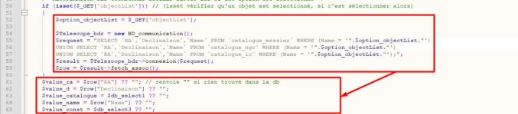

- Dans le script JavaScript, l’ancienne version pour $result→fetch\_assoc(); récupérait également la colonne, on s’occupera ainsi de cacher les 3 lignes "Name" de chaque catalogue.
4. **Gérer l’absence de GPS**

En cas de problèmes avec le GPS, deux erreurs sont possibles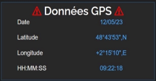 : le GPS n’est pas détecté ou une erreur est survenu. Glisser le curseur sur le titre fera apparaître un message d’erreur informant l’utilisateur de la résolution possible.

Des données sont ajoutés, l’heure et la date depuis la Raspberry ainsi que des coordonnées par défaut (Lycée de Vilgenis)

**7.4. Rendre le site web responsive et + ergonomique**

Après la mise en forme du site avec des unités non influençable, on choisira d’adapter la taille de la page en fonction de la taille de l’écran, pour cela on re-modélisera tout les objets suivants avec des mesures relatives (vw, vh, %, em) en faisant de nombreux test :

- Les boutons
- Les switchs
- Les textes
- Les div, span et formulaires
- Les types d’affichage (flex, grid, etc)
- Les input, select
- Les objets créés (LED)

Afin de rendre l’utilisation de l’IHM plus intuitive, on choisira de :

- Développer une nouvelle mise en forme avec des couleurs dans un thème similaire, on évitera de choisir des couleurs trop différentes
- On éliminera les couleurs mis en évidence pour rien (bord du site, des divs en bleu, titres en bleu etc), on appliquera un thème grisâtre sur l’ensemble des divs et un thème bleu pour les valeurs rentrés par l’utilisateur : textes, select, bouton, placeholder et label doivent être changés + disposition des objets sur le site.

→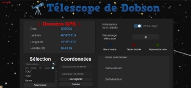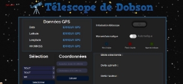

8. **Communication avec ESP et format de transmission**

L’IHM hébergé sur la Raspberry devra affiché les informations reçu par l’ESP et envoyer les interactions de l’utilisateur sur celui ci. Le protocole utilisé sera TCP afin de privilégier l’état de la donnée transmise.

**ENVOI CLIENT RASPBERRY →SERVEUR ESP**

L’ESP devra recevoir les interactions de l’utilisateur via l’envoi d’une chaîne de caractère dans le format suivant :

action,données

L’action est un nombre entre 0 et 99 permettant d’identifier le besoin de l’utilisateur, les données transmises seront donc envoyés selon celui ci :

- 00 : Réinitialisation du télescope (bouton STOP)

Données → NULL

- 01 : Démarrage du télescope en mode manuel (action des codeurs)

Données → "<nombre\_pas\_deltaAz>;<nombre\_pas\_deltaAlt>"

- 02 : Démarrage  du télescope en mode automatique (action des moteurs)

Données → "<nombre\_pas\_deltaAz>;<nombre\_pas\_deltaAlt>"

**RÉPONSE SERVEUR ESP → CLIENT RASPBERRY**

L’ESP devra répondre au client en renvoyant les informations nécessaires. données

- 00 : Réinitialisation du télescope (bouton STOP)

Données → renvoie 1 lorsque le télescope est arreté.

- 01 : Démarrage du télescope en mode manuel (action des codeurs)

Données → "<nombre\_pas\_restant\_deltaAz>;<nombre\_pas\_restant\_deltaAlt>"

- 02 : Démarrage  du télescope en mode automatique (action des moteurs)

Données → "<nombre\_pas\_restant\_deltaAz>;<nombre\_pas\_restant\_deltaAlt>;<erreur>" <erreur> : 1 si mouvement parasite, 0 si correct

*~~ENVOI RASPBERRY DEPUIS ESP~~*

~~*On notera un format d’échange de l’ESP à la Raspberry de 9 octets :* temps,décomptage1,décomptage2,numéro\_téléscope~~

~~￿     *ASCII→ 6 octets : Temps : pour coder l’heure la minute et la secondes*~~

~~￿     *Entier*~~ *~~non~~ ~~signé→~~ ~~2~~ ~~octets~~ ~~:~~ ~~Décomptage1~~ ~~nombre~~ ~~pas~~ ~~pour~~ ~~coder~~ ~~jusqu’à~~ ~~360~~ ~~possibilités~~*

~~￿     *Entier*~~ *~~non~~ ~~signé→~~ ~~2~~ ~~octets~~ ~~:~~ ~~Décomptage2~~ ~~nombre~~ ~~pas~~ ~~pour~~ ~~coder~~ ~~jusqu’à~~ ~~360~~ ~~possibilités~~* ~~￿     *Entier non signé→ 1 octet : codage du numéro télescope*~~

*~~ENVOI ESP DEPUIS RASPBERRY~~*

~~*L’ESP devra recevoir les interactions de l’utilisateur via un nombre transmis sur un octet.* nombre,deltaaz,deltaalt~~

~~￿     *Entier non signé→ 1 octet : nombre correspondant à l’action à effectuer*~~

~~￿     *Entier non signé→ 2 octets : nombre pas delta azimut*~~

~~￿     *Entier non signé→ 2 octets : nombre pas delta hauteur*~~

9. **Communication avec l’ESP : sockets**

On prépare la trame a envoyé avec javascript : coordonnées, action à réaliser selon le format nécessaire de la page ci dessus. On la transmet a un code client de socket en PHP pour l'envoyer au serveur ESP qui va traiter la trame en conséquence. Celui ci enverra les informations nécessaire (par exemple le décomptage de pas restant) en réponse et sera transmis sur le client PHP qui devra renvoyer à l’IHM à l’aide d’Ajax.

10. **Ajout de catalogues dans la base de données**
1. **Préparation et ajout des catalogues dans la base de donnée**

Dans la table du catalogue de Messier ajouté on peut remarqué qu’il y a une colonne répertoriant ces objets dans un catalogue plus vaste encore : le catalogue NGC (=New General Catalogue).

Après des recherches pour obtenir ce catalogue mis à jour récememnt, une table composé de ce catalogue et de l’IC (Index Catalogue), un supplément au catalogue NGC a été trouvé sur GitHub. <https://raw.githubusercontent.com/mattiaverga/OpenNGC/master/database_files/NGC.csv>

On choisira de séparer ces deux catalogues dans deux tables csv et de mettre les mêmes noms de colonnes (on actualisera le catalogue de Messier récupérer auparavant).

On ajoutera dans la table du catalogue de Messier les abréviations des 88 constellations manquantes pour avoir les mêmes colonnes.

On accède à <http://192.168.4.1/phpmyadmin/> et on supprime la table pour rajouter les 3 nouveaux catalogues.

Après de nombreuses erreurs de permissions (suppression manuel de la DB et restauration de la table de Messier), de problèmes d’importations à cause de données ne passant pas sur phpmyadmin, on supprime les dizaines de colonnes inutiles des catalogues et on les importe. Des modifications sont faites dans le code PHP pour mettre à jour les requêtes SQL et les colonnes de chaque table seront renommés pour avoir des noms similaires.

Pour l’affichage sur l’IHM, 3 balises select seront mis en place :

1. Sélection du catalogue
1. Sélection de la constellation (filtre)
1. Sélection de l’astre

La première étape est d’importer les catalogues sur l’IHM, on doit afficher les astres à partir du choix de l’utilisateur. A noter que le terme "selected" ajouté dans la balise permet d’afficher l’option par défaut de l’utilisateur pour afficher son choix précédent comme étant sélectionné à l’actualisation de la page (on garde une trace).

Pour une question d’ergonomie, la sélection de l’utilisateur devra actualiser les résultats des astres proposés sans qu’il y est besoin de cliquer sur un bouton. On commence par réaliser la sélection du catalogue avec le bouton puis une question doit se poser : faut-il réaliser l’actualisation coté serveur ou coté client. Toujours pour économiser des ressources serveurs et pour limiter le temps d’affichage de l’utilisateur on choisira d’importer l’ensemble des noms des 3 catalogues qui sera visible avec tout. Ainsi, JavaScript détectera l’événement de la sélection et cachera les éléments non demandés à l’utilisateur à l’aide d’une balise CSS. Ci dessous un extrait :

2. **Création d’un filtre de constellation selon le catalogue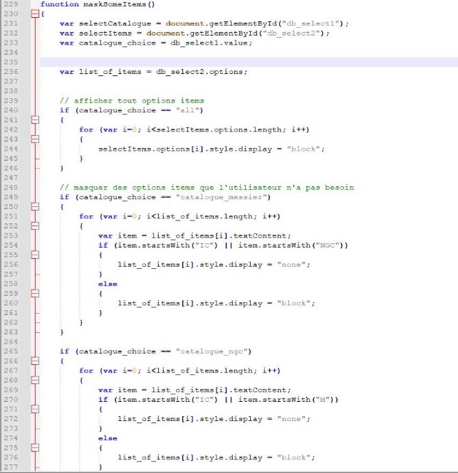**

L’importation d’environ 10 000 astres et l’opération d’affichage est tout de même chronophage, pour cela nous ajouterons des fonctionnalités de filtres, par exemple l’ajout d’un filtre de constellation.

On affichera les 88 constellations dans ce select et on créera de nombreuses opérations d’affichages pour faciliter l’utilisation de l’utilisateur.

Code source détaillé dans le dossier source.

Deux fonctions devront s’exécuter à chaque changement de sélection dans un ordre différent. Puisque l’objet choisi est chargé par PHP, lors de l’actualisation de la page on choisira également de garder cet objet pour se souvenir de la décision de l’utilisateur. Pour cela on utilisera select sur l’objet choisi et une condition se réalisera sur l’affichage de chaque option pour savoir quelle option a été choisi par l’utilisateur.

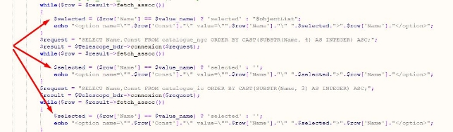

Cela permettra donc à l’utilisateur de retrouver l’option qu’il a choisi en premier élément de la liste des astres.

Dans JavaScript on assemblera la fonction des deux filtres après test pour gérer le changement à n’importe quel moment de ces options.

3. **Création d’un filtre de saison et d’hémisphère**

Après comparaison des types d’affichage, on choisit pour une div au dessus affiché en flex, on split en deux div, une de 80 % possédant quatre boutons pour chaque saison, une de 20 % pour un bouton correspondant au choix de l’hémisphère.

Les clics de chaque boutons sont placés dans un formulaire et font appel à des fonctions javascript qui bloque l’envoi du formulaire à php à l’aide de event.preventDefault();.

En fonction de la saison 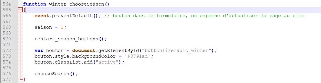

choisi, on changera la valeur 

d’une variable globale saison 

correspondant au bouton 

cliqué : 1 hiver, 2 printemps, 

3 été et 4 automne. On 

applique le style de base de tout les boutons, on change le style du bouton cliqué et on appelle une fonction pour le filtrage. La fonction appellé chooseSeason() va permettre dans une première partie de filtrer les 88 constellations, en masquant les constellations qui ne sont pas observable dans la saison actuelle.

A l’aide d’un outil de génération de code on crée un tableau répertoriant la meilleure saison d’observation pour les 88 constellations :

On en créera un autre pour l’hémisphère sud.

Il sera ensuite nécessaire de filtrer les astres en fonction de la période d’observation des constellations des tableaux. Afin de ne pas provoquer des conflits d’affichage il sera important de suivre un ordre précis (on affiche tout les objets et on masque selon les filtres choisi petit à petit : catalogue > constellations > hemisphere > saison

Après mise en forme des boutons :

4. **Création d’une barre de recherche**

On ajoute une barre de recherche en html/CSS avec l’affichage flex.

Lorsque l’utilisateur clique, on empêche l’envoi du formulaire, on récupère la valeur de l’input et ci celle-ci existe elle est sélectionné. On provoque l’envoie du formulaire et la sélection de l’astre choisi est bien importé, sinon une alerte est donné informant que l’astre n’est pas disponible (on mettra l’input de l’utilisateur en majuscule pour éviter les conflits de casse).

**11. Ajout d’un catalogue personnalisé et la possibilité de sauvegarder des astres (Ajax)**

On crée une table csv pour stocker les objets personnalisés, et on l’importe dans MySql à partir de PhpMyAdmin.

On crée un nouveau bouton pour permettre à l’utilisateur de sauvegarder son objet

 

On doit encadrer cette partie dans un formulaire et celui ci va interférer avec les moyens d’affichage des parents (%), pour cela on appliquera un affichage en ligne (display: inline;).

 

On implémente un code Ajax, et on affiche une alerte si cela fonctionne. Le code PHP est appelé et on prépare une requête SQL sur PhpMyAdmin pour communiquer avec la DB sur PHP, si celle ci fonctionne alors le code PHP est fonctionnel. On crée alors un code SQL pour préparer une relation d’un catalogue

personnalisé : 

Puis une commande SQL pour ajouter des informations dans cette table :

La prochaine étape est donc de transmettre les informations du formulaire pour ajouter des éléments personnalisés dans le catalogue.

Préparation d’un fichier texte d’exemples d’étoiles à rajouter :

On récupère ensuite les données de l’IHM en javascript puis on les transmet dans le bloc Ajax.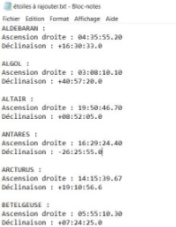

On reçoit ces données dans le fichier save\_star.php grâce à la méthode GET, et on peut personnaliser l’ajout de l’étoile dans le catalogue.

On traite un minimum les données reçues pour ajouter sans erreur l’étoile de l’utilisateur, on applique des filtres :

- Nom en majuscule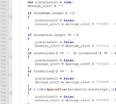
- Limite de caractères sur le nom de l’étoile
- Limite de caractères sur les coordonnées
- Contrôle des et indication des erreurs de formatage (point virgules, virgule, signe)
- Vérification des valeurs numériques découpés

Afin de ne pas rentrer en conflit avec des noms étoiles déjà présents dans les catalogues astronomiques basiques, on vérifiera que le nom est unique en améliorant la requête SQL :

INSERT INTO catalogue\_custom (Name, RA, Declinaison, Const) SELECT '$starName', '$ascension', '$declinaison', 'none'

FROM dual

WHERE NOT EXISTS (

SELECT \* FROM catalogue\_custom WHERE Name = '$starName' ) AND NOT EXISTS (

SELECT \* FROM catalogue\_messier WHERE Name = '$starName' ) AND NOT EXISTS (

SELECT \* FROM catalogue\_ic WHERE Name = '$starName'

) AND NOT EXISTS (

SELECT \* FROM catalogue\_ngc WHERE Name = '$starName'

On indiquera à l’utilisateur que l’étoile existe déjà par le biais d’une vérification JavaScript, à commencer par ajouter les étoiles du catalogue personnalisé dans la liste des astres observables dans le bloc de sélection de l’IHM web.

Pour cela on rajoute le choix du catalogue personnalisé, et on affiche chaque objet par le biais d’une requête comme les autres catalogues. La modification des filtres est nécessaire : on doit mettre dans chaque condition de choix du catalogue la vérification des astres personnalisés, on peut les reconnaître grâce à une constellation "none" qui leur est donné dans la balise select. Ainsi il nous faut optimiser les conditions pour qu’elles soient plus rapides (les conditions sont maintenant plus compact) et on instaure les nouvelles vérifications.

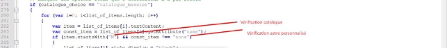

Il ne reste plus qu’à effectuer la vérification de la présence du nom de l’astre dans la liste des objets sur l’IHM.

Pour cela on réalise une boucle javascript qui compare l’ensemble des options avec l’objet à rajouter, l’utilisateur est informé en plus des erreurs de format précédent en cas de conflit de noms.

On ajoutera une option à l’utilisateur pour pouvoir supprimer l’étoile du catalogue, pour cela on détecte si les coordonnées sont vides, un message de confirmation lui sera alors demandé pour savoir si il veut bien supprimer l’étoile.

Des tests SQL ont été réalisés sur le site et sur PhpMyAdmin. Si un problème survient avec la sauvegarde il est possible d’ouvrir le fichier de sauvegarde seul save\_star.php pour regarder l’erreur PHP. Des valeurs par défaut seront alors ajoutés à la place de la réception Ajax pour éviter des erreurs de variables introuvables :

E6.2 Téléscope : Fiche Technique IHM WEB 22/22
